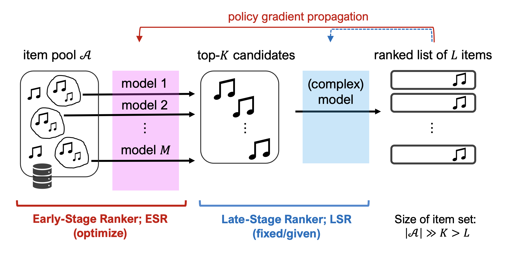

## Credit-assigned Policy Gradient for Early Stage Retrieval in Two-stage Ranking

---

<div style="text-align: center;">
 
</div>

### About

This repository contains the source code to replicate the synthetic and real-data experiments conducted in the paper "Credit-assigned Policy Gradient for Early Stage Retrieval in Two-stage Ranking" by [Haruka Kiyohara](https://sites.google.com/view/harukakiyohara) $^1$, Mihaela Curmei $^2$, Ariel Evnine $^2$, Shankar Kalyanaraman $^2$, Israel Nir $^2$, Ana-Roxana Pop $^2$, Nitzan Razin $^2$, [Sarah Dean](https://sdean.website/) $^1$, [Thorsten Joachims](https://www.cs.cornell.edu/people/tj/) $^1$, and Udi Weinsberg $^2$. Most of the work was done while Haruka Kiyohara was interning at the Central Applied Science (CAS) team at Meta Platforms, Inc. (Affiliation: $^1$: Cornell University, $^2$: Meta Platforms, Inc. ) [[paper]()] [[arXiv]()] [[slide]()]

<details>
<summary><strong>Click here to show the abstract </strong></summary>

Large-scale search, recommendation, and retrieval-augmented generation (RAG) systems typically employ a two-stage architecture: an early-stage ranker (ESR) generates a candidate set, which is subsequently re-ranked by a late-stage ranker (LSR). While there are many reinforcement learning (RL) methods for training the LSR, end-to-end training of the ESR has proven challenging. In particular, naive application of ``vanilla'' policy gradient (V-PG) is not scalable for candidate-set sizes relevant for practical use due to exploding variance.
This issue arises because V-PG propagates the gradient to the joint probability of the candidate sets, ignoring the contribution of each specific item in the candidate set to the reward.
To mitigate this issue, we propose a novel **"credit-assigned" PG (CA-PG)**, which computes gradients with respect to the probability that the target item is chosen in any candidate set, i.e. marginalizing over all candidate sets that contain it. 
Our theoretical analysis reveals that CA-PG significantly reduces the variance of V-PG by marginalizing over the specific composition of the candidate set, while preserving the ability to learn the correct ranking of actions under a reasonably aligned LSR policy. Experiments on both synthetic and real-world data demonstrate that CA-PG 
improves the convergence speed and training stability for ESRs utilizing the canonical Plackett-Luce model, especially when the candidate-set size is large.

</details>

If you find this code useful in your research then please site:
```
@inproceedings{kiyohara2026credit,
  author = {Kiyohara, Haruka and Curmei, Mihaela and Evnine, Ariel and Kalyanaraman, Shankar and Nir, Israel and Pop, Ana-Roxana and Razin, Nitzan and Dean, Sarah and Joachims, Thorsten and Weinsberg, Udi},
  title = {Credit-assigned Policy Gradient for Early Stage Retrieval in Two-stage Ranking},
  booktitle = {xxx},
  pages = {xxx-xxx},
  year = {2026},
}
```

### Preparation

To run the code, please make sure that the following libraries are installed.

```bash
numpy=>1.24.3
torch=>2.1.0
pandas=>2.0.2
wanbd=>0.19.8
hydra-core=>1.3.2
```

Then, connect the `pythonpath` to the repository as follows:

```bash
cd ~/meta_early_stage_retrieval/experiments/synthetic
export PYTHONPATH="~/meta_early_stage_retrieval/:$PYTHONPATH"
```

### Synthetic experiments

The code can be run by the following command. (To compare the computational time, use `runtime_online_policy.py` instead.)

```bash
python3 train_online_policy.py logs.rootdir=~/meta_early_stage_retrieval/experiments/synthetic/logs
setting.n_output_action=1 setting.n_candidate_action_train=10 setting.n_candidate_action_eval=10
setting.late_stage_optimality=optimal model.credit_assignment_type=CA setting.start_random_seed=0
model.n_moe_model=5
```

Then, the learned policy is stored in the following location.

```bash
~/meta_early_stage_retrieval/experiments/synthetic/logs/online_early_stage/credit={ALL/CA/TOP1}/{detailed_configs}.pt
```

Similarly, the training processes (e.g., policy values, action choice probs, and train losses) are stored in the following location.

```bash
~/meta_early_stage_retrieval/experiments/synthetic/logs/online_early_stage/training_process/credit={ALL/CA/TOP1}/{action_probs/policy_values/train_losses}/{detailed_configs}.pt
```

Note that the important configurations are summarized as follows:

- `logs.rootdir` : specify the log directory
- `setting.n_output_action` : length of final ranking (L), default=1
- `setting.n_candidate_action_train` , `setting.n_candidate_action_eval` : \# of candidates (K), default=10, two configs should match
- `setting.late_stage_optimality` : optimality of the late stage, default=optimal
- `model.credit_assignment_type` : which PG method to use, “ALL” (V-PG), “CA” (CA-PG), “TOP1” (CA-PG-SwR). Note that, even when using the MoE model, please use “TOP1” for CA-PG-SwR.
- `model.is_vanilla_replacement` : whether to use SwR approximation when using “ALL” (V-PG), default=False
- `model.n_moe_model` : how many base models are used for mixture-of-experts (MoE). default=1 
- `setting.start_random_seed` : which random seeds to start from. 
- `setting.n_random_seed` : how many random seeds to run. 

For the other configurations, please also refer to the following folders:

```bash
~/meta_early_stage_retrieval/experiments/synthetic/conf
```

### Real-data experiments

We use [KuaiRec](https://kuairec.com/) dataset for the real-data experiment. Please first locate the small matrix dataset in the following location.

```bash
~/meta_early_stage_retrieval/experiments/synthetic/data/kuairec_small_matrix.csv
```

Then, run the code as followss

```bash
python3 train_online_policy_kuairec.py logs.rootdir=~/meta_early_stage_retrieval/experiments/synthetic/logs path.dataset_path=~/meta_early_stage_retrieval/experiments/synthetic/data/kuairec_small_matrix.csv setting.n_output_action=1 setting.n_candidate_action_train=100 setting.n_candidate_action_eval=100 setting.late_stage_optimality=optimal model.credit_assignment_type=TOP1 setting.start_random_seed=0 model.n_moe_model=1
```

The parameter settings are the same with the synthetic experiments. The learned policy will be stored in the following location.

```bash
~/meta_early_stage_retrieval/experiments/synthetic/logs/online_early_stage/Kuairec,credit={ALL/CA/TOP1}/{detailed_configs}.pt
```

The training processes witll be stored in the following location.

```bash
~/meta_early_stage_retrieval/experiments/synthetic/logs/online_early_stage/training_process/KuaiRec,credit={ALL/CA/TOP1}/{action_probs/policy_values/train_losses}/{detailed_configs}.pt
```


## License

This project is [CC-BY-NC 4.0](https://creativecommons.org/licenses/by-nc/4.0/) licensed, as found in the LICENSE file.
